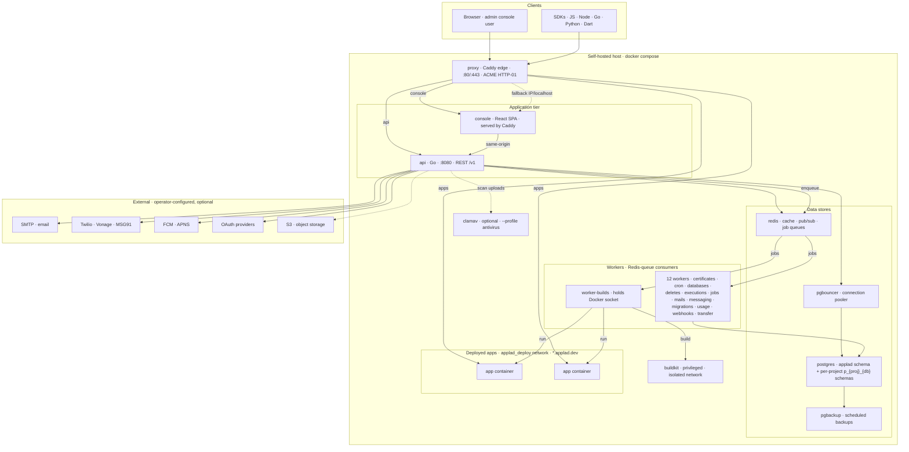

# Applad architecture (self-hosted)

This is the architecture of the **self-hostable** product in this repository:
exactly what `docker compose up` brings up, and nothing more. The extra web
properties and multi-domain provisioning that Mittolabs Cloud runs on top of this
(the marketing site, the docs site, the status page, the cloud-only services and
the Ansible provisioning) are **deliberately excluded** here; they live in the
private `mittolabs/applad-cloud` repo and are drawn in that repo's own
architecture diagram.

The diagram is [Mermaid](https://mermaid.js.org/) so it renders on GitHub and in
the docs, and is versioned as text alongside the code.

## Components

| Service | Role |
|---|---|
| **proxy** (Caddy) | The only public entry point. Terminates TLS itself via ACME (HTTP-01, no DNS API needed for fixed hosts). Routes by hostname; an unknown host (an IP, `localhost`) falls back to the console. |
| **console** | React + Vite admin SPA, served as a static bundle by Caddy with SPA fallback. Talks to the API same-origin at `/v1`. |
| **api** (Go) | The single API server. Connects to Postgres + Redis, runs migrations on boot, serves `/v1`, and enqueues background work to Redis. Does **not** hold the Docker socket. |
| **postgres** | Primary store. Product tables live in the `applad` schema; each project's user data lives in its own `p_{projectId}_{databaseId}` schema with RLS. |
| **pgbouncer** | Connection pooler in front of Postgres. |
| **pgbackup** | Scheduled database backups. |
| **redis** | Cache, pub/sub (realtime), and the BRPOP-based job queues the workers consume. |
| **workers** (13) | Independent Redis-queue consumers. `worker-builds` is the **only** service with the Docker socket mounted, so it is the only thing that can start containers (builds, deploys, test/browser containers). The rest: certificates, cron, databases, deletes, executions, jobs, mails, messaging, migrations, usage, webhooks, transfer (data migrations). |
| **buildkit** | Privileged image builder on an isolated network whose only peer is `worker-builds`. |
| **clamav** | Optional antivirus for uploads; off unless started with `--profile antivirus`. |
| **deployed apps** | Customer app containers on the `applad_deploy` network, reached by the proxy by container name and served on `*.applad.dev`. |

## Two domains, on purpose

- **`console.applad.io`** and **`api.applad.io`** (and the fallback) are the
  platform. On a self-hosted box these resolve to whatever host it runs on.
- **`*.applad.dev`** is given to deployed customer apps alone, so arbitrary
  customer code never shares a registrable domain with the console (no cookie or
  same-site leakage into the console).

## Not in the self-hosted stack

No marketing site, docs site or status page; no multi-vhost edge or DNS-01
wildcard; no Kubernetes; no billing/entitlements, regions, or the Applad Cloud
GitHub App (git deploys fall back to public repositories unless an operator
registers their own app via `GITHUB_APP_*`); signup closes after the first
account (`CONSOLE_SIGNUP_ENABLED=auto`). All of that is the cloud layer, drawn in
`applad-cloud`.
