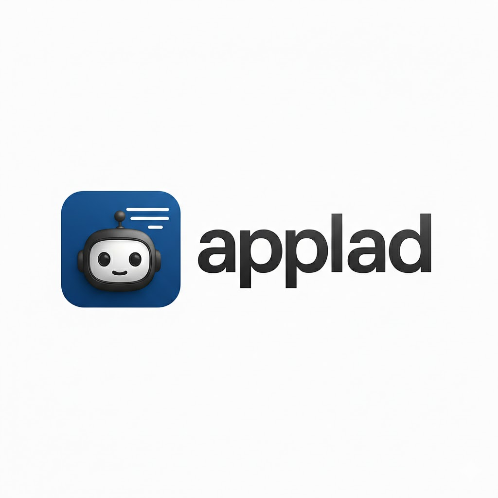

<p align="center">
  
</p>

<h1 align="center">Applad</h1>

<p align="center">
  Open-source backend-as-a-service with a built-in workflow automation engine.<br/>
  Self-hosted. Flutter Web console. Go backend. One <code>docker compose up</code>.
</p>

---

## What is Applad?

Applad is a self-hosted, open-source backend-as-a-service: **Auth, Databases, Storage, Functions, Realtime, Messaging, and Workflows** — managed through a Flutter Web admin console.

Your data. Your infrastructure. No vendor lock-in.

---

## Services

| Service | What you get |
|---|---|
| **Auth** | Email/password, OAuth2 (Google, GitHub, Apple + 12 more), magic link, anonymous sessions, MFA (TOTP), email verification, password reset, teams & memberships |
| **Databases** | Tables, typed columns (string, integer, float, boolean, email, URL, datetime, enum, relationships), indexes, rows with 12 query operators |
| **Storage** | Buckets, single + chunked file upload, image transformations (resize, format conversion), encryption, ClamAV antivirus |
| **Functions** | Container-based serverless: Node.js, Bun, Python, Go, Dart, Rust, Ruby, PHP, or any custom Dockerfile. Pre-warmed containers, HTTP invocation |
| **Realtime** | WebSocket pub/sub with auto-publishing on database and storage events |
| **Messaging** | Email (SMTP), SMS (Twilio), push notifications (FCM), topics & subscribers |
| **Workflows** | Native DAG engine: manual/webhook triggers, HTTP requests, conditions, delays, code nodes, execution history |
| **Avatars** | Generated initials, QR codes, credit card icons, country flags, favicon proxy |
| **Locale** | 196 countries, 50+ currencies, 50+ languages, phone codes |
| **Health** | Database, cache, and service health checks |

---

## Quick Start

### Prerequisites

- [Docker](https://docs.docker.com/get-docker/) and Docker Compose

### Run

```bash
git clone https://github.com/mittolabs/applad
cd applad
cp .env.example .env
# Edit .env — at minimum set JWT_SECRET to a strong random value
docker compose up -d
```

Open `http://localhost` in your browser. You'll see the signup screen — create your admin account and follow the onboarding stepper.

### What starts

| Service | Port | Description |
|---|---|---|
| **proxy** | 80 | Nginx reverse proxy — routes to API and console |
| **api** | 8080 (internal) | Go API server with all services |
| **console** | 3000 (internal) | Flutter Web admin UI |
| **mariadb** | 3306 (internal) | Primary database |
| **redis** | 6379 (internal) | Cache, pub/sub, job queues |
| **10 workers** | — | Background processors (builds, deletes, executions, webhooks, etc.) |

### Backend only (skip Flutter build)

```bash
docker compose up api mariadb redis proxy -d
```

---

## Console

1. **Sign up** — First user creates the admin account. Signup auto-disables after that (configurable via `CONSOLE_SIGNUP_ENABLED`).
2. **Onboarding** — Create your first project, generate an API key, get SDK install snippets.
3. **Overview** — Usage dashboard showing resource counts across all services.
4. **Databases** — Create databases, tables, define columns and indexes, browse rows.
5. **Storage** — Manage buckets, upload/download files, preview images with transformations.
6. **Auth** — Manage users, view sessions, create accounts.
7. **Functions** — Create functions, pick a runtime, edit source code, execute, view execution history.
8. **Deploy** — Manage deployments with status lifecycle.
9. **Messaging** — Send emails, SMS, push notifications.
10. **Workflows** — Build automation flows with triggers, nodes, conditions. Execute and view step-by-step logs.
11. **Settings** — Project management, API key creation.

---

## Functions Runtime

Applad runs functions as **standard HTTP containers**. No proprietary SDK required — if it can serve HTTP, it's a function.

### Built-in runtimes

| Runtime | Base image |
|---|---|
| `node-18`, `node-20`, `node-22` | `node:XX-alpine` |
| `bun-1` | `oven/bun:alpine` |
| `python-3.11`, `python-3.12` | `python:3.XX-alpine` |
| `go-1.22` | `golang:1.22-alpine` |
| `dart-3` | `dart:stable` |
| `rust-1` | `rust:alpine` |
| `ruby-3` | `ruby:3-alpine` |
| `php-8` | `php:8-alpine` |
| `custom` | Your own Dockerfile |

### How it works

**Simple path** — Write a handler function. Applad wraps it in an HTTP server automatically:

```javascript
// Node.js — just export a function
module.exports = async function(payload) {
  return { message: `Hello ${payload.name}!` };
};
```

```python
# Python — define a handler function
def handler(payload):
    return {"message": f"Hello {payload.get('name')}!"}
```

**Advanced path** — Provide a Dockerfile. Run Express, Flask, Gin, anything:

```dockerfile
FROM node:20-alpine
WORKDIR /app
COPY package*.json ./
RUN npm install
COPY . .
EXPOSE 3000
CMD ["node", "server.js"]
```

### Pre-warming

Functions are built and a warm container is started **at deploy time**, not at first invocation. First request latency: ~10-50ms (warm), not 5-30s (cold).

---

## Workflow Engine

Native Go DAG executor. Workflows are defined as a graph of nodes and executed by a background worker.

```
Trigger → Node → Node → Node → Result
              ↘ Node (condition false) → skipped
```

### Node types

| Type | Description |
|---|---|
| `http_request` | HTTP call with configurable method, URL, headers, body |
| `send_email` | Send email via SMTP |
| `set_variable` | Set a key/value in the execution context |
| `code` | Go template expression evaluation |
| `if_condition` | Branch based on field comparison (eq, neq, contains, etc.) |
| `delay` | Wait for a configured duration |

### Triggers

- **Manual** — `POST /v1/workflows/{id}/execute`
- **Webhook** — `POST /v1/workflows/webhooks/{id}` (public, no auth required)

---

## SDKs

### Client-side (session/JWT auth)

```bash
# Dart / Flutter — add to pubspec.yaml
dependencies:
  applad:
    path: path/to/applad/sdks/dart

# JavaScript / TypeScript — install from local
cd sdks/js && npm install && npm run build
# Then in your project:
npm install path/to/applad/sdks/js
```

```dart
// Dart
final client = Applad(endpoint: 'https://your-domain.com', projectId: 'your-project');
final user = await client.auth.createAccount(email: 'user@example.com', password: 'password123');
```

```typescript
// JavaScript
import { Applad } from '@mittolabs/applad';
const client = new Applad({ endpoint: 'https://your-domain.com', projectId: 'your-project' });
const user = await client.auth.createAccount('user@example.com', 'password123');
```

### Server-side (API key auth)

```bash
# Node.js
cd sdks/node && npm install && npm run build

# Dart — add to pubspec.yaml
dependencies:
  applad_dart:
    path: path/to/applad/sdks/dart-server

# Go — use as local module
go mod edit -replace github.com/mittolabs/applad-go=path/to/applad/sdks/go

# Python
pip install -e path/to/applad/sdks/python
```

```typescript
// Node.js
import { ApplAdServer } from '@mittolabs/applad-node';
const server = new ApplAdServer({
  endpoint: 'https://your-domain.com',
  projectId: 'your-project',
  apiKey: 'applad_key_...',
});
const users = await server.users.listUsers();
```

```go
// Go
client := applad.New("https://your-domain.com", "your-project", "applad_key_...")
users, _ := client.Users().ListUsers()
```

```python
# Python
from applad import Client
client = Client("https://your-domain.com", "your-project", "applad_key_...")
users = client.users.list_users()
```

### SDK service coverage

| Service | Client JS | Client Dart | Server Node | Server Dart | Server Go | Server Python |
|---|---|---|---|---|---|---|
| Auth / Users | auth | auth, users | users | users | users | users |
| Databases | databases | databases | databases | databases | databases | databases |
| Storage | storage | storage | storage | storage | storage | storage |
| Functions | functions | functions | functions | functions | functions | functions |
| Workflows | workflows | workflows | workflows | workflows | workflows | workflows |
| Messaging | messaging | messaging | messaging | messaging | messaging | messaging |
| Deploy | deploy | deploy | deploy | deploy | deploy | deploy |
| Teams | — | — | teams | teams | teams | teams |
| Avatars | avatars | — | — | — | — | — |
| Locale | locale | — | — | — | — | — |

---

## Configuration

All configuration is via environment variables. Copy `.env.example` and customize:

```bash
cp .env.example .env
```

### Core

| Variable | Default | Description |
|---|---|---|
| `JWT_SECRET` | — | **Required.** HS256 signing key. Must change from default. |
| `DATABASE_DSN` | `applad:applad@tcp(mariadb:3306)/applad?parseTime=true` | MariaDB connection |
| `REDIS_ADDR` | `redis:6379` | Redis connection |
| `STORAGE_PATH` | `/var/applad/storage` | File storage directory |
| `APP_ENV` | `development` | `development` or `production` |
| `PORT` | `8080` | API server port |

### Console

| Variable | Default | Description |
|---|---|---|
| `CONSOLE_SIGNUP_ENABLED` | `auto` | `auto` = disabled after first user. `true` = always. `false` = never. |

### Email (SMTP)

| Variable | Default | Description |
|---|---|---|
| `SMTP_HOST` | — | SMTP server host |
| `SMTP_PORT` | `587` | SMTP port |
| `SMTP_USER` | — | SMTP username |
| `SMTP_PASS` | — | SMTP password |
| `SMTP_FROM` | `noreply@applad.local` | Sender address |

### OAuth2

| Variable | Description |
|---|---|
| `OAUTH_GOOGLE_CLIENT_ID` | Google OAuth2 client ID |
| `OAUTH_GOOGLE_CLIENT_SECRET` | Google OAuth2 client secret |
| `OAUTH_GITHUB_CLIENT_ID` | GitHub OAuth2 client ID |
| `OAUTH_GITHUB_CLIENT_SECRET` | GitHub OAuth2 client secret |
| `OAUTH_APPLE_CLIENT_ID` | Apple Sign-In client ID |
| `OAUTH_APPLE_CLIENT_SECRET` | Apple Sign-In client secret |

### Messaging providers

| Variable | Description |
|---|---|
| `TWILIO_SID` | Twilio Account SID for SMS |
| `TWILIO_TOKEN` | Twilio Auth Token |
| `TWILIO_FROM` | Twilio sender phone number |
| `FCM_SERVER_KEY` | Firebase Cloud Messaging server key |

---

## API Reference

All endpoints under `/v1`. Full OpenAPI spec at `backend/api/openapi.yaml`.

| Route | Auth | Description |
|---|---|---|
| `/health` | None | Health checks (server, DB, cache) |
| `/console` | None / Console JWT | Admin signup, login, session |
| `/projects` | None | Project CRUD, API keys, usage stats |
| `/avatars` | None | Generated images (initials, QR, flags) |
| `/locale` | None | Countries, currencies, languages |
| `/account` | Project header | Client-side auth (signup, login, OAuth2, MFA, magic link, verification, recovery) |
| `/users` | Project + Auth | Server-side user management |
| `/teams` | Project + Auth | Teams and memberships |
| `/databases` | Project + Auth | Databases, tables, columns, indexes, relationships, rows with query operators |
| `/storage` | Project + Auth | Buckets, files, chunked upload, image preview |
| `/functions` | Project + Auth | Functions CRUD, execution, runtimes list |
| `/messaging` | Project + Auth | Email, SMS, push, topics |
| `/deploy` | Project + Auth | Deployment management |
| `/workflows` | Project + Auth | Workflow CRUD, execute, execution history |
| `/workflows/webhooks/{id}` | Project header | Public webhook trigger |
| `/realtime` | Project header | WebSocket connection |

---

## Architecture

```
                    ┌─────────┐
                    │  Proxy  │ :80
                    └────┬────┘
                    ┌────┴────┐
              ┌─────┤  Routes ├─────┐
              │     └─────────┘     │
        ┌─────▼─────┐        ┌─────▼─────┐
        │  API :8080 │        │  Console  │
        └─────┬─────┘        └───────────┘
              │
    ┌─────────┼──────────┐
    │         │          │
┌───▼───┐ ┌──▼──┐ ┌─────▼─────┐
│MariaDB│ │Redis│ │ 10 Workers│
└───────┘ └─────┘ └───────────┘
```

- **Go backend** — single binary, chi router, 26 internal packages
- **MariaDB** — primary store, 9 migrations, JSON document storage
- **Redis** — cache, pub/sub (realtime), job queues (workers)
- **10 workers** — builds, certificates, databases, deletes, executions, mails, messaging, migrations, usage, webhooks
- **Flutter console** — Riverpod + GoRouter, 9 feature pages + overview + onboarding
- **6 SDKs** — Dart, JavaScript, Node.js, Dart (server), Go, Python

---

## Development

### Prerequisites

- Go 1.22+
- Flutter 3.22+ / Dart 3.3+
- Node.js 18+ (for JS/Node SDKs)
- Docker

### Backend

```bash
cd backend
go build ./...          # compile
go test ./...           # unit tests
go vet ./...            # lint
gofmt -w .              # format
```

### Console + Dart SDK

```bash
make bootstrap          # first time: melos + npm install
melos analyze           # lint all Dart packages
melos test              # test all Dart packages
melos build:web         # build Flutter console for production
```

### TypeScript SDK

```bash
cd sdks/js && npm install && npm run build && npm test
```

### Node.js Server SDK

```bash
cd sdks/node && npm install && npm run build
```

---

## License

BSD 3-Clause. See [LICENSE](LICENSE).
