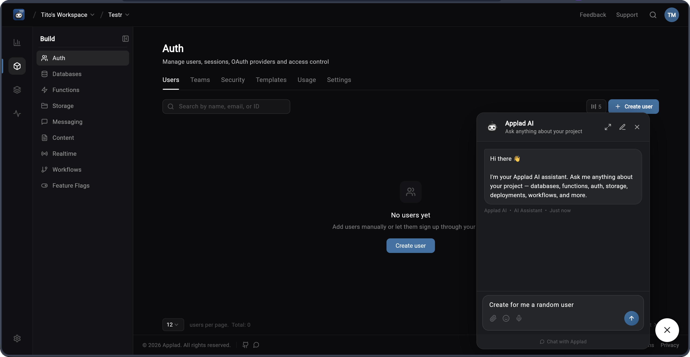

<p align="center">
  
</p>

<h2 align="center">Build products, not infrastructure.</h2>

<p align="center">
  Applad gives your team every backend primitive — auth, databases, storage,<br/>
  functions, realtime, messaging, and a visual workflow engine —<br/>
  without handing your data to someone else's cloud.
</p>

<br/>

<p align="center">
  <a href="https://github.com/mittolabs/applad/actions/workflows/ci.yml">
    
  </a>
  <a href="https://github.com/mittolabs/applad/releases">
    
  </a>
  <a href="https://github.com/mittolabs/applad/blob/main/LICENSE">
    
  </a>
  
  
  <a href="https://github.com/mittolabs/applad/stargazers">
    
  </a>
</p>

<br/>
  
</p>

---

## Self-host

**Requirements**: Docker with the Compose plugin. Nothing else.

```bash
curl -fsSL https://raw.githubusercontent.com/mittolabs/applad/main/install.sh | bash
```

The installer will ask for your domain, TLS preference (none, Let's Encrypt, or custom cert), storage driver, and SMTP settings. Secrets are generated automatically. When it's done, open the URL it prints and create your admin account.

**To upgrade:**

```bash
./install.sh upgrade
```

---

## What's included

| | |
|---|---|
| **Auth** | Email/password, 15 OAuth2 providers, magic link, anonymous sessions, MFA (TOTP), email verification, password reset |
| **Databases** | Tables, typed columns, indexes, relationships, row CRUD, 12 query operators, cursor pagination, schema-scoped SQL |
| **Storage** | Buckets, single + chunked upload, image resize & format conversion, optional ClamAV antivirus |
| **Functions** | Container-based serverless — Node.js, Bun, Python, Go, Dart, Rust, Ruby, PHP, or any Dockerfile |
| **Realtime** | WebSocket pub/sub — auto-publishes on every database and storage change |
| **Messaging** | Email (SMTP), SMS (Twilio), push (FCM), topics & subscribers |
| **Workflows** | Native DAG engine — HTTP, email, conditions, delays, code nodes, webhook triggers |
| **Teams** | Team CRUD, memberships, role-based access |
| **Deploy** | Deployment lifecycle management with Docker-based executor |

---

## Contributing

Pull requests are welcome.

### Local dev stack

The dev compose gives you the full stack with hot-reload — no build step needed:

```bash
docker compose -f docker-compose.dev.yml up
```

- **API** reloads on every `.go` file save (via [Air](https://github.com/air-verse/air))
- **Console** runs Flutter's web dev server with `--hot` on port 3000
- **Workers** start with `go run` — restart a specific one after changes: `docker compose -f docker-compose.dev.yml restart worker-migrations`
- **Postgres** (port 5432) and **Redis** (port 6379) are exposed for direct access

**Prerequisites**: Docker with the Compose plugin. Go, Flutter, and Node are only needed if you want to run things outside of Docker.

### Tests & lint

```bash
# Backend
cd backend && go test ./... && go vet ./...

# Console + Dart SDK
make bootstrap   # first time only
melos analyze && melos test

# TypeScript SDKs
cd sdks/js && npm install && npm run build && npm test
```

## Security

If you discover a security vulnerability please **do not** open a public issue. See [SECURITY.md](SECURITY.md) for the responsible disclosure process.


## Contributing

We welcome contributions of all sizes — bug fixes, docs, new SDK methods, or entirely new features. See [CONTRIBUTING.md](CONTRIBUTING.md) for how to get started.


## License

BSD 3-Clause. See [LICENSE](LICENSE).
